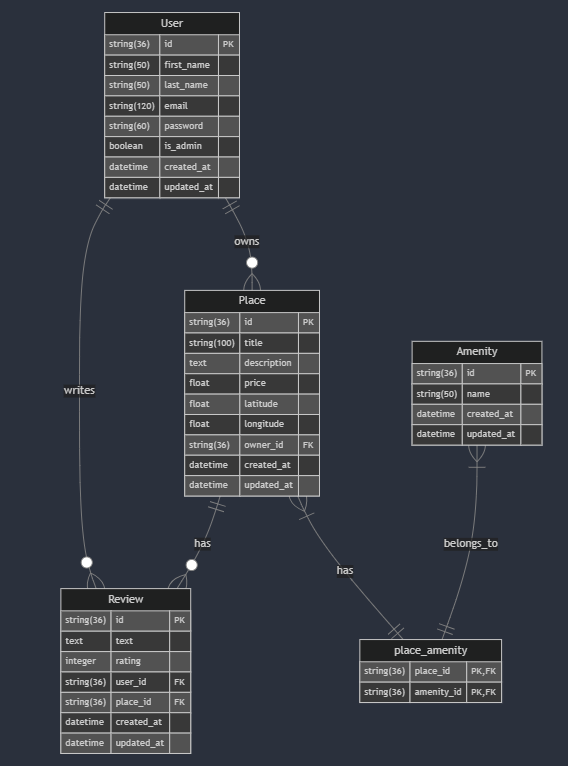

# 🏠 HBnB - Business Logic Layer

## 🎯 Features
Notre application offre un ensemble complet de fonctionnalités essentielles :
- **UUID-based identification**: Identifiants uniques pour chaque objet
- **Timestamp tracking**: Suivi précis des dates de création et modification
- **Data validation**: Validation robuste des données entrantes
- **Relationship management**: Gestion intelligente des relations entre objets
- **Object serialization**: Conversion facile des objets pour le stockage/transmission
- **Comprehensive unit tests**: Tests complets pour assurer la fiabilité

## 📋 Requirements
Pour démarrer avec le projet, vous aurez besoin de :
- Python 3.7 ou version supérieure
- Module UUID pour la génération d'identifiants uniques
- Module DateTime pour la gestion des timestamps
- Un environnement virtuel Python (recommandé)

## 🏗️ Project Structure

### 📦 Models
L'application est construite autour de quatre modèles principaux, chacun avec un rôle spécifique dans l'écosystème :

#### 🔧 BaseModel
Le modèle de base dont héritent tous les autres modèles :
- **Rôle**: Fournit les fonctionnalités communes à tous les modèles
- **Attributs**:
  - `id`: Identifiant unique UUID (jamais répété)
  - `created_at`: Horodatage de création
  - `updated_at`: Horodatage de dernière modification
- **Méthodes principales**:
  - `save()`: Met à jour l'horodatage
  - `update(data)`: Met à jour les attributs depuis un dictionnaire

#### 👤 User
Gestion des utilisateurs de la plateforme :
- **Rôle**: Stocke et gère les informations utilisateur
- **Attributs**:
  - `first_name`: Prénom (limité à 50 caractères)
  - `last_name`: Nom (limité à 50 caractères)
  - `email`: Adresse email (validée)
  - `is_admin`: Statut administrateur
- **Méthodes clés**:
  - `add_place(place)`: Lie un logement à l'utilisateur
  - `add_review(review)`: Ajoute un avis

#### 🏡 Place
Gestion des propriétés à louer :
- **Rôle**: Centralise les informations sur les logements
- **Attributs**:
  - `title`: Titre de l'annonce (max 100 caractères)
  - `description`: Description détaillée
  - `price`: Prix par nuit (nombre positif)
  - `latitude` & `longitude`: Coordonnées géographiques
  - `owner`: Référence au propriétaire
- **Méthodes importantes**:
  - `add_review(review)`: Ajoute un avis
  - `add_amenity(amenity)`: Ajoute un équipement

#### ⭐ Review
Système d'avis et de notation :
- **Rôle**: Permet aux utilisateurs de partager leur expérience
- **Attributs**:
  - `text`: Contenu de l'avis
  - `rating`: Note de 1 à 5
  - `place`: Référence au logement
  - `user`: Référence à l'auteur

#### 🛋️ Amenity
Gestion des équipements disponibles :
- **Rôle**: Liste les caractéristiques des logements
- **Attributs**:
  - `name`: Nom de l'équipement (max 50 caractères)

## 💻 Usage Examples
Voici comment utiliser les principales fonctionnalités :

### 📝 Creating a User and Place
```python
# Create a new user
user = User(
    first_name="John",
    last_name="Doe",
    email="john.doe@example.com"
)

# Create a place owned by the user
place = Place(
    title="Cozy Apartment",
    description="Beautiful city center apartment",
    price=100.0,
    latitude=48.8566,
    longitude=2.3522,
    owner=user
)

# Add amenities
wifi = Amenity("Wi-Fi")
place.add_amenity(wifi)

# Add a review
review = Review(
    text="Great stay!",
    rating=5,
    place=place,
    user=user
)
```

## 🚀 Installation
Pour installer et configurer le projet :
```bash
# Créer un environnement virtuel
python3 -m venv env

# Activer l'environnement
source env/bin/activate  # Linux/Mac
# ou
.\env\Scripts\activate  # Windows

# Installer les dépendances
pip install -r requirements.txt
```

## 🧪 Running Tests
Pour exécuter la suite de tests :
```bash
python -m unittest tests/test_models.py
```

## 📊 Diagramme
Voici la structure de la base de données et les relations entre les modèles :


## 🔍 Conclusion
Ce projet implémente une architecture robuste pour la gestion de locations de propriétés, avec un accent particulier sur la maintenabilité et l'extensibilité. La documentation ci-dessus devrait vous permettre de comprendre et d'utiliser efficacement chaque composant du système.


